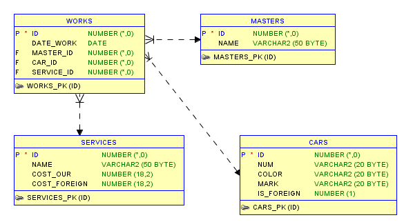
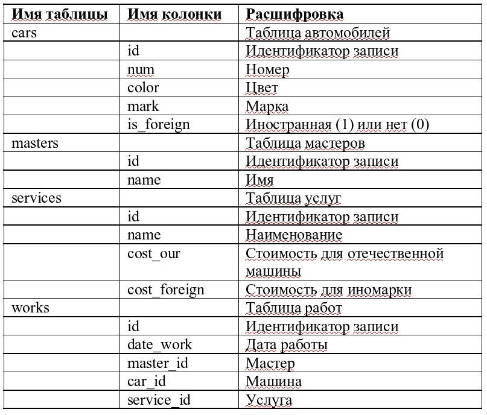
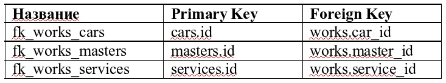

  
# Java-Course-Work-Car-Service  
  
## 🔥Задание🔥:  

Разработать клиент-серверное приложение на заданную тему.  

Список обязательных к использованию технологий при выполнении работы:  
**1.Клиент:🌕**  
  - `требования отсутствуют, можете использовать любые известные вам языки :)`  
  
**2.Сервер:🌑**  
  - `Java 12 и выше`  
  - `База данных на выбор - SLQLite/PostreSQL/MS SQL/Oracle.
    Схему БД, соответствующую заданию, см. ниже.`  
  - `SpringData/Hibernate для работы с БД`  
  - `Spring Security`  
  - `Взаимодействие с клиентом осуществляется посредством REST API.`  
  
  
  **Вариант 9: Автоматизация работы автосервиса**  
  Схема базы данных:  
    
  
    
  
  Связи между таблицами: 
  
